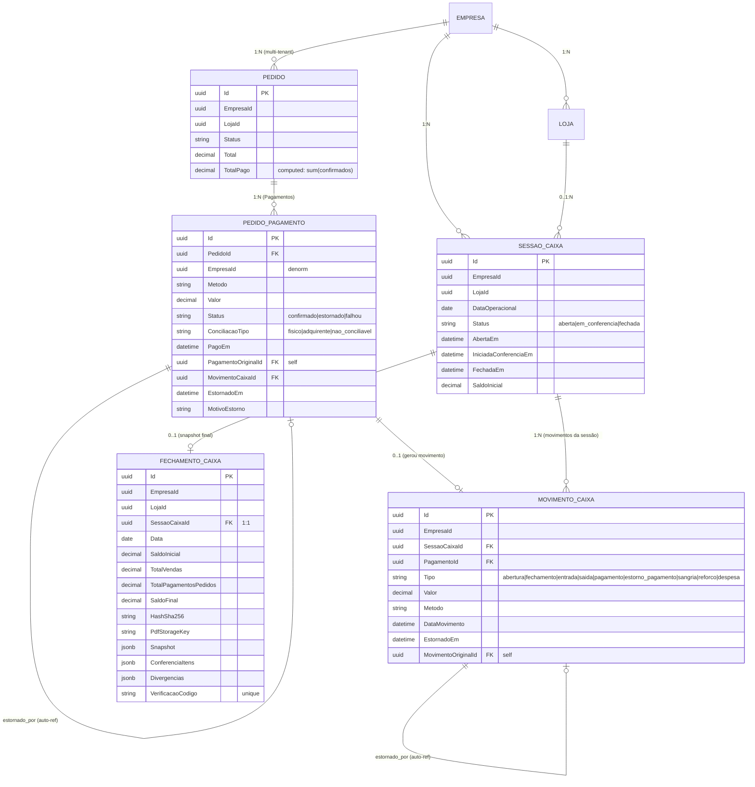

# 01 — Domínio Integrado

> Parte do [Plano](README.md). Anterior: [00-reconhecimento.md](00-reconhecimento.md). Próximo: [02-estados-e-eventos.md](02-estados-e-eventos.md).

### B.1 Entidades novas e expansões

#### B.1.a `SessaoCaixa` (NOVA — tabela `sessoes_caixa`)

```csharp
namespace EasyStock.Domain.Entities;

public class SessaoCaixa
{
    public Guid Id { get; set; }                       // PK Guid v7 (EF default)
    public Guid EmpresaId { get; set; }                // NOT NULL, FK empresas(id) RESTRICT
    public Guid? LojaId { get; set; }                  // FK lojas(id) SET NULL
    public DateOnly DataOperacional { get; set; }      // dia contábil (não datetime)
    public DateTime AbertaEm { get; set; }             // timestamptz
    public Guid? AbertaPorUserId { get; set; }
    public string? AbertaPorNome { get; set; }         // varchar(120)
    public decimal SaldoInicial { get; set; }          // numeric(14,2) — sangria/troco inicial
    public DateTime? IniciadaConferenciaEm { get; set; } // timestamptz, nullable
    public DateTime? FechadaEm { get; set; }           // timestamptz, nullable
    public Guid? FechadaPorUserId { get; set; }
    public string? FechadaPorNome { get; set; }        // varchar(120)
    public string Status { get; set; } = "aberta";     // varchar(20): "aberta"|"em_conferencia"|"fechada"
    public string? Observacoes { get; set; }           // text, nullable

    public Empresa? Empresa { get; set; }
    public Loja? Loja { get; set; }
    public ICollection<MovimentoCaixa> Movimentos { get; set; } = new List<MovimentoCaixa>();
    public FechamentoCaixa? Fechamento { get; set; }   // 1:1 quando status=fechada

    public static SessaoCaixa Abrir(Guid empresaId, Guid? lojaId, DateOnly data,
        decimal saldoInicial, Guid? userId, string? userNome) { /* factory */ }

    public void IniciarConferencia() { /* state machine */ }
    public void Fechar(Guid? userId, string? userNome, string? observacoes) { /* state machine */ }
}
```

**Schema Postgres** (criado via migration EF Core code-first):

```sql
CREATE TABLE sessoes_caixa (
  id uuid PRIMARY KEY,
  empresa_id uuid NOT NULL,
  loja_id uuid NULL,
  data_operacional date NOT NULL,
  aberta_em timestamptz NOT NULL,
  aberta_por_user_id uuid NULL,
  aberta_por_nome varchar(120) NULL,
  saldo_inicial numeric(14,2) NOT NULL DEFAULT 0,
  iniciada_conferencia_em timestamptz NULL,
  fechada_em timestamptz NULL,
  fechada_por_user_id uuid NULL,
  fechada_por_nome varchar(120) NULL,
  status varchar(20) NOT NULL DEFAULT 'aberta',
  observacoes text NULL,
  CONSTRAINT fk_sessoes_caixa_empresa FOREIGN KEY (empresa_id) REFERENCES empresas(id) ON DELETE RESTRICT,
  CONSTRAINT fk_sessoes_caixa_loja FOREIGN KEY (loja_id) REFERENCES lojas(id) ON DELETE SET NULL,
  CONSTRAINT chk_sessoes_caixa_status CHECK (status IN ('aberta','em_conferencia','fechada')),
  CONSTRAINT chk_sessoes_caixa_saldo_inicial CHECK (saldo_inicial >= 0)
);

-- Índices
CREATE UNIQUE INDEX ux_sessoes_caixa_aberta_por_dia
  ON sessoes_caixa (empresa_id, COALESCE(loja_id, '00000000-0000-0000-0000-000000000000'::uuid), data_operacional)
  WHERE status IN ('aberta','em_conferencia');
-- ↑ garante: 1 sessão não-fechada por (empresa, loja, dia)

CREATE INDEX ix_sessoes_caixa_empresa_status
  ON sessoes_caixa (empresa_id, status, data_operacional DESC);

CREATE INDEX ix_sessoes_caixa_empresa_data
  ON sessoes_caixa (empresa_id, data_operacional DESC);
```

**FKs**:
- `empresa_id → empresas(id) ON DELETE RESTRICT` (empresa não pode ser deletada se tem sessão)
- `loja_id → lojas(id) ON DELETE SET NULL` (loja apagada vira sessão "matriz")

**Cardinalidade 1 ano (Casa da Babá ~50 ped/dia, 1 sessão/dia)**:
- 365 sessões/ano/loja → 4MB/ano. Negligível.

**RLS policy** (quando RLS subir em master):
```sql
ALTER TABLE sessoes_caixa ENABLE ROW LEVEL SECURITY;
CREATE POLICY tenant_isolation_sessoes_caixa ON sessoes_caixa
  USING (empresa_id = current_setting('app.current_empresa_id')::uuid
      OR current_setting('app.bypass_rls', true) = 'on');
```

#### B.1.b Expansão de `PedidoPagamento` (tabela `pedido_pagamentos` — **ADD COLUMN aditivo**)

```csharp
public class PedidoPagamento
{
    // ── EXISTENTES (sem mudança) ────────────────
    public Guid Id { get; set; }
    public Guid PedidoId { get; set; }
    public string Metodo { get; set; } = "outro";
    public decimal Valor { get; set; }
    public string? Referencia { get; set; }
    public string? Observacao { get; set; }
    public DateTime PagoEm { get; set; }
    public Guid? RegistradoPorUserId { get; set; }
    public string? RegistradoPorNome { get; set; }
    public Pedido? Pedido { get; set; }

    // ── NOVOS (todos com default seguro para backfill) ────────────────
    public Guid EmpresaId { get; set; }                // denormalizado (backfill via JOIN Pedido)
    public string Status { get; set; } = "confirmado"; // "confirmado"|"estornado"|"falhou"
    public string ConciliacaoTipo { get; set; } = "fisico"; // "fisico"|"adquirente"|"nao_conciliavel"
    public DateTime? EstornadoEm { get; set; }
    public Guid? EstornadoPorUserId { get; set; }
    public string? EstornadoPorNome { get; set; }
    public string? MotivoEstorno { get; set; }
    public Guid? PagamentoOriginalId { get; set; }     // self-ref para estornos
    public PedidoPagamento? PagamentoOriginal { get; set; }
    public Guid? MovimentoCaixaId { get; set; }        // FK opcional (pagamento sem caixa = retroativo)
    public MovimentoCaixa? MovimentoCaixa { get; set; }
}
```

**Mapeamento `Metodo` → `ConciliacaoTipo` (default no backfill)**:
| Método | ConciliacaoTipo |
|---|---|
| `dinheiro` | `fisico` |
| `pix` | `adquirente` (cai na conta, não no caixa físico) |
| `credito` | `adquirente` |
| `debito` | `adquirente` |
| `transferencia` | `adquirente` |
| `outro` | `fisico` (conservador — operador clarifica) |
| `voucher` (futuro) | `nao_conciliavel` |

**Schema Postgres alterations**:

```sql
ALTER TABLE pedido_pagamentos
  ADD COLUMN empresa_id uuid NULL,
  ADD COLUMN status varchar(20) NOT NULL DEFAULT 'confirmado',
  ADD COLUMN conciliacao_tipo varchar(20) NOT NULL DEFAULT 'fisico',
  ADD COLUMN estornado_em timestamptz NULL,
  ADD COLUMN estornado_por_user_id uuid NULL,
  ADD COLUMN estornado_por_nome varchar(120) NULL,
  ADD COLUMN motivo_estorno text NULL,
  ADD COLUMN pagamento_original_id uuid NULL,
  ADD COLUMN movimento_caixa_id uuid NULL,
  ADD CONSTRAINT chk_pedido_pagamentos_status
    CHECK (status IN ('confirmado','estornado','falhou')),
  ADD CONSTRAINT chk_pedido_pagamentos_conciliacao
    CHECK (conciliacao_tipo IN ('fisico','adquirente','nao_conciliavel')),
  ADD CONSTRAINT chk_pedido_pagamentos_valor_positivo
    CHECK (valor > 0),
  ADD CONSTRAINT fk_pedido_pagamentos_pagamento_original
    FOREIGN KEY (pagamento_original_id) REFERENCES pedido_pagamentos(id) ON DELETE RESTRICT,
  ADD CONSTRAINT fk_pedido_pagamentos_movimento_caixa
    FOREIGN KEY (movimento_caixa_id) REFERENCES movimentos_caixa(id) ON DELETE SET NULL;

-- empresa_id é nullable inicialmente para backfill em batches; após backfill, NOT NULL.

CREATE INDEX CONCURRENTLY ix_pedido_pagamentos_empresa_status
  ON pedido_pagamentos (empresa_id, status);
CREATE INDEX CONCURRENTLY ix_pedido_pagamentos_movimento_caixa
  ON pedido_pagamentos (movimento_caixa_id) WHERE movimento_caixa_id IS NOT NULL;
CREATE INDEX CONCURRENTLY ix_pedido_pagamentos_pagamento_original
  ON pedido_pagamentos (pagamento_original_id) WHERE pagamento_original_id IS NOT NULL;
CREATE INDEX CONCURRENTLY ix_pedido_pagamentos_pago_em_empresa
  ON pedido_pagamentos (empresa_id, pago_em DESC) WHERE status = 'confirmado';
```

**Cardinalidade 1 ano (Casa da Babá)**:
- 50 pedidos/dia × ~1.2 pagamentos médio × 365 = ~22k linhas/ano. Negligível.

#### B.1.c Expansão de `MovimentoCaixa` (tabela `movimentos_caixa` — **ADD COLUMN aditivo**)

```csharp
public class MovimentoCaixa
{
    // ── EXISTENTES (sem mudança) ────────────────
    // (todos os campos do snapshot atual)

    // ── NOVOS ────────────────
    public Guid? SessaoCaixaId { get; set; }           // FK opcional (movimentos retroativos pré-feature ficam null)
    public SessaoCaixa? SessaoCaixa { get; set; }
    public Guid? PagamentoId { get; set; }             // se foi gerado por pagamento de pedido
    public PedidoPagamento? Pagamento { get; set; }
    public Guid? MovimentoOriginalId { get; set; }     // self-ref para estornos
    public MovimentoCaixa? MovimentoOriginal { get; set; }
}
```

```sql
ALTER TABLE movimentos_caixa
  ADD COLUMN sessao_caixa_id uuid NULL,
  ADD COLUMN pagamento_id uuid NULL,
  ADD COLUMN movimento_original_id uuid NULL,
  ADD CONSTRAINT fk_movimentos_caixa_sessao
    FOREIGN KEY (sessao_caixa_id) REFERENCES sessoes_caixa(id) ON DELETE RESTRICT,
  ADD CONSTRAINT fk_movimentos_caixa_pagamento
    FOREIGN KEY (pagamento_id) REFERENCES pedido_pagamentos(id) ON DELETE RESTRICT,
  ADD CONSTRAINT fk_movimentos_caixa_original
    FOREIGN KEY (movimento_original_id) REFERENCES movimentos_caixa(id) ON DELETE RESTRICT,
  ADD CONSTRAINT chk_movimentos_caixa_tipo_novo
    CHECK (tipo IN ('abertura','fechamento','entrada','saida','pagamento','estorno_pagamento','sangria','reforco','despesa'));
-- ↑ AMPLIA enum sem remover valores antigos (compatibilidade)

CREATE INDEX CONCURRENTLY ix_movimentos_caixa_sessao
  ON movimentos_caixa (sessao_caixa_id) WHERE sessao_caixa_id IS NOT NULL;
CREATE INDEX CONCURRENTLY ix_movimentos_caixa_pagamento
  ON movimentos_caixa (pagamento_id) WHERE pagamento_id IS NOT NULL;
```

**Cardinalidade**: 50 ped/dia × 1.2 pag = 60 mov/dia + ~5 manuais = 65/dia = 24k/ano. Negligível.

#### B.1.d Expansão de `FechamentoCaixa` (tabela `fechamentos_caixa` — **ADD COLUMN aditivo**)

```csharp
public class FechamentoCaixa
{
    // ── EXISTENTES ────────────────
    // (campos atuais)

    // ── NOVOS ────────────────
    public Guid? SessaoCaixaId { get; set; }
    public SessaoCaixa? SessaoCaixa { get; set; }
    public string? HashSha256 { get; set; }            // 64 hex chars
    public string? PdfStorageKey { get; set; }         // chave em IFileStorage (varchar 255)
    public string? SnapshotJson { get; set; }          // jsonb: snapshot detalhado por método
    public string? ConferenciaItensJson { get; set; }  // jsonb: esperado/contado/divergencia por método
    public string? DivergenciasJson { get; set; }      // jsonb: lista de divergências com justificativas
    public string? VerificacaoCodigo { get; set; }     // slug opaco 16 chars URL-safe, unique
    public DateTime? EmailContadorEnviadoEm { get; set; }
    public string? EmailContadorDestinatario { get; set; } // varchar(255)
}
```

```sql
ALTER TABLE fechamentos_caixa
  ADD COLUMN sessao_caixa_id uuid NULL,
  ADD COLUMN hash_sha256 varchar(64) NULL,
  ADD COLUMN pdf_storage_key varchar(255) NULL,
  ADD COLUMN snapshot_json jsonb NULL,
  ADD COLUMN conferencia_itens_json jsonb NULL,
  ADD COLUMN divergencias_json jsonb NULL,
  ADD COLUMN verificacao_codigo varchar(32) NULL,
  ADD COLUMN email_contador_enviado_em timestamptz NULL,
  ADD COLUMN email_contador_destinatario varchar(255) NULL,
  ADD CONSTRAINT fk_fechamentos_caixa_sessao
    FOREIGN KEY (sessao_caixa_id) REFERENCES sessoes_caixa(id) ON DELETE RESTRICT;

CREATE UNIQUE INDEX CONCURRENTLY ux_fechamentos_caixa_verificacao_codigo
  ON fechamentos_caixa (verificacao_codigo) WHERE verificacao_codigo IS NOT NULL;
CREATE INDEX CONCURRENTLY ix_fechamentos_caixa_sessao
  ON fechamentos_caixa (sessao_caixa_id) WHERE sessao_caixa_id IS NOT NULL;
```

**Imutabilidade após fechamento**: garantida via interceptor EF
`FechamentoCaixaImutavelInterceptor` (novo) que rejeita `Update` em entidade
existente quando `Status` da sessão = `fechada`. Erros de ajuste futuro
viram **MovimentoCaixa de ajuste na próxima sessão** (B.2.3).

### B.2 Justificativas de design

#### B.2.1 Por que `MovimentoCaixa` é separado de `PedidoPagamento` (não inline)

- **Caso 1 (sangria/reforço/despesa)**: movimento sem pagamento de pedido.
  Operador tira R$200 do caixa para pagar fornecedor → MovimentoCaixa tipo
  `saida`, sem pagamento associado.
- **Caso 2 (pagamento retroativo / caixa fechado)**: cliente paga PIX 23h após
  fechamento. PedidoPagamento criado com `MovimentoCaixaId = NULL`. Não
  abre caixa retroativo. Aparece em relatório do dia via agregação (já feito
  hoje em `GetTotalPagamentosPedidosDoDiaAsync`).
- **Caso 3 (estorno)**: `MovimentoCaixa.MovimentoOriginalId` aponta para
  movimento revertido. `MovimentoCaixa.Tipo = 'estorno_pagamento'` (valor
  positivo, mas sinal negativo via `SinalNoCaixa` ampliado).

#### B.2.2 Decisão D1.3 (pedido pago em caixa fechado)

**Recomendação: HÍBRIDA** — manter abertura automática atual (Casa da Babá
já usa) MAS bloquear quando sessão está `em_conferencia`.

| Cenário | Comportamento |
|---|---|
| Nenhuma sessão hoje, primeiro pagamento | Abre sessão automaticamente (saldo inicial = 0), cria MovimentoCaixa tipo `pagamento` linkado |
| Sessão aberta no dia | Cria MovimentoCaixa linkado à sessão aberta |
| Sessão `em_conferencia` no dia | **HTTP 423 Locked**: "Caixa em conferência — peça ao operador para finalizar ou cancelar a conferência antes de registrar pagamento" |
| Sessão `fechada` no dia (mesmo `DataOperacional`) | PedidoPagamento criado com `MovimentoCaixaId = NULL`. Avisa via banner amarelo: "Pagamento retroativo — caixa de hoje já fechado. Aparece no relatório do próximo dia." |
| Sessão `fechada` em data passada | Mesma regra: PedidoPagamento sem movimento, retroativo |

**Trade-off honesto**:
- Bloqueio total (opção (a) pura) cria fricção para Casa da Babá que opera
  sem ritual de "abrir caixa" no início do dia.
- Enfileiramento puro (opção (b)) cria fantasma de movimento aparecer só
  depois — confusão de auditoria.
- Híbrido escolhido: preserva fluxo atual + adiciona proteção apenas no
  ponto crítico (em_conferencia).

#### B.2.3 Erros após fechamento → MovimentoCaixa de ajuste

Operador percebe que esqueceu de lançar despesa de R$50 ontem (sessão já
fechada). Não pode editar `FechamentoCaixa.SaldoFinal`.

Procedimento:
1. Operador abre sessão de hoje normalmente (ou usa sessão aberta).
2. Lança `MovimentoCaixa` tipo `saida`, categoria `"ajuste_sessao_anterior"`,
   `Referencia` = ID do FechamentoCaixa anterior, `Descricao` = "Ajuste:
   despesa de R$50 não lançada em 14/05 — fornecedor X".
3. Relatório da sessão de hoje mostra o ajuste em seção separada
   "Ajustes de períodos anteriores" (filtro por `Categoria LIKE 'ajuste_%'`).

Sem reabertura, sem `UPDATE` em fechamento, sem invalidação de hash.

#### B.2.4 Voucher / crédito-cliente

**Fora de escopo F0** (memory: voucher não existe como conceito hoje). Plano
preserva `ConciliacaoTipo = 'nao_conciliavel'` como enum para futuro. Mapeamento
de método `voucher` quando feature for adicionada: insere `PedidoPagamento`
com `ConciliacaoTipo = 'nao_conciliavel'` → `MovimentoCaixa` é criado mas com
`Tipo = 'pagamento'`/`Metodo = 'voucher'` que aparece em coluna separada do
relatório, **não soma no esperado de dinheiro físico**.

#### B.2.5 Cartão/PIX no fechamento (3 totais)

Relatório do fechamento mostra:

| Categoria | Soma |
|---|---|
| **Esperado dinheiro físico** | `SaldoInicial + Σ(MovimentoCaixa.ConciliacaoTipo='fisico'.SinalNoCaixa) + Σ(entradas extras dinheiro) - Σ(saidas extras dinheiro)` |
| **Esperado a receber adquirente** | `Σ(PedidoPagamento.ConciliacaoTipo='adquirente' por método)` — separado por pix/credito/debito/transferencia. Conciliação bancária real é fora deste escopo. |
| **Não conciliável** | `Σ(PedidoPagamento.ConciliacaoTipo='nao_conciliavel')` |
| **Total geral** | soma dos 3 |

Operador conta APENAS dinheiro físico no wizard. Cartão/pix aparecem
informativamente (com botão "marcar como conferido externamente"), sem
exigir contagem.

### B.3 Diagrama ER (Mermaid)



### B.4 Nomenclatura — **segue ADR-0011 existente** (sem nova regra)

`docs/adr/0011-nomenclatura-pt-br-rotulagem.md` (Accepted 2026-05-16, escopo
estendido a "qualquer módulo novo deste ponto em diante") **já é a regra
do projeto**: PT-BR para substantivos de negócio, EN apenas para sufixos
técnicos consagrados (`Renderer`, `Interceptor`, `Repository`, `Service`,
`Handler`, `Factory`, `Validator`, `Middleware`, `Generator`, `HostedService`,
`Event`, `Provider`, `Adapter`, `Job`) e conceitos sem equivalente PT
natural (`Snapshot`, `Hash`, `Cache`). Padrão híbrido aceito:
`{SubstantivoPT}{SufixoEN}` (ex: `CalculadoraNutricional`, `RotuloHandler`,
`FaturaPdfRenderer`).

Este módulo **referencia** ADR-0011, não cria regra paralela. Não há
necessidade de novo ADR de nomenclatura.

**Entidades novas/expandidas (substantivo PT puro)**:

| Entidade | Tabela | Notas |
|---|---|---|
| `SessaoCaixa` | `sessoes_caixa` | Nova |
| `PedidoPagamento` (expandida) | `pedido_pagamentos` (mantida) | ADD COLUMN aditivo |
| `MovimentoCaixa` (expandida) | `movimentos_caixa` (mantida) | ADD COLUMN aditivo |
| `FechamentoCaixa` (expandida) | `fechamentos_caixa` (mantida) | ADD COLUMN aditivo |

**5 nomes finais para classes que nascem em F1-F6** (validados contra
ADR-0011 + exemplos do código existente como `FaturaPdfRenderer`,
`AuditTimestampsInterceptor`, `PedidoStateMachine`, `EstornarPagamentoUseCase`):

| Componente | Nome final | Pasta | Justificativa ADR-0011 |
|---|---|---|---|
| Renderer do PDF | `FechamentoCaixaPdfRenderer` | `EasyStock.Infra.Async/Pdf/` | Substantivo PT + sufixos EN consagrados (`Pdf`, `Renderer`). Espelha `FaturaPdfRenderer:23`. |
| Interceptor de imutabilidade | `FechamentoCaixaImutavelInterceptor` | `EasyStock.Infra.Postgre/Data/Interceptors/` | Adjetivo PT + sufixo EN consagrado. Espelha `AuditTimestampsInterceptor`. |
| State machine | `SessaoCaixaStateMachine` | `EasyStock.Domain/Caixa/` | `StateMachine` é sufixo EN consagrado já no projeto (`PedidoStateMachine.cs:33`). |
| Gerador de slug de verificação | `GeradorCodigoVerificacaoFechamento` | `EasyStock.Application/UseCases/CaixaSessoes/Common/` | Verbo→substantivo PT, sem sufixo EN porque "Gerador" é PT natural (ADR-0011 exemplo: `GeradorListaIngredientes`). |
| Calculadora de hash | `CalculadoraHashFechamento` | `EasyStock.Application/UseCases/CaixaSessoes/Common/` | Substantivo PT (`Calculadora`) + sufixo EN consagrado (`Hash`, conceito sem equivalente PT natural). Espelha `CalculadoraNutricional` do P-02. |

**Eventos de domínio**: `PagamentoConfirmadoEvent`, `PagamentoEstornadoEvent`,
`SessaoCaixaIniciandoFechamentoEvent`, `SessaoCaixaFechadaEvent`,
`MovimentoManualRegistradoEvent` (substantivo PT + sufixo EN `Event` — exemplo
ADR-0011: `ProdutoComposicaoAlteradoEvent`).

**UseCases**: `ConfirmarPagamentoUseCase`, `EstornarPagamentoUseCase`,
`ListarPagamentosPedidoUseCase`, `AbrirSessaoCaixaUseCase`,
`RegistrarMovimentoManualUseCase`, `IniciarFechamentoSessaoUseCase`,
`CancelarConferenciaUseCase`, `ConfirmarFechamentoSessaoUseCase`,
`ListarSessoesCaixaUseCase`, `BaixarPdfFechamentoUseCase`,
`VerificarFechamentoPublicoUseCase` (verbo imperativo PT + sufixo EN
consagrado).

**Handlers (consumers de eventos inline)**: `CriarMovimentoCaixaParaPagamentoHandler`,
`CriarMovimentoCaixaParaEstornoHandler`, `EstornarPagamentosCancelamentoHandler`,
`GerarPdfFechamentoHandler`.

**Property names (todos PT-BR)**: `Status`, `Valor`, `Metodo`, `EstornadoEm`,
`MotivoEstorno`, `ConciliacaoTipo`, `SaldoInicial`, `DataOperacional`,
`VerificacaoCodigo`, `HashSha256` (`Hash` permitido por ADR-0011 como
conceito sem equivalente PT). Datas usam `CriadoEm`/`AlteradoEm` (não
`CreatedAt`/`UpdatedAt`).

---
