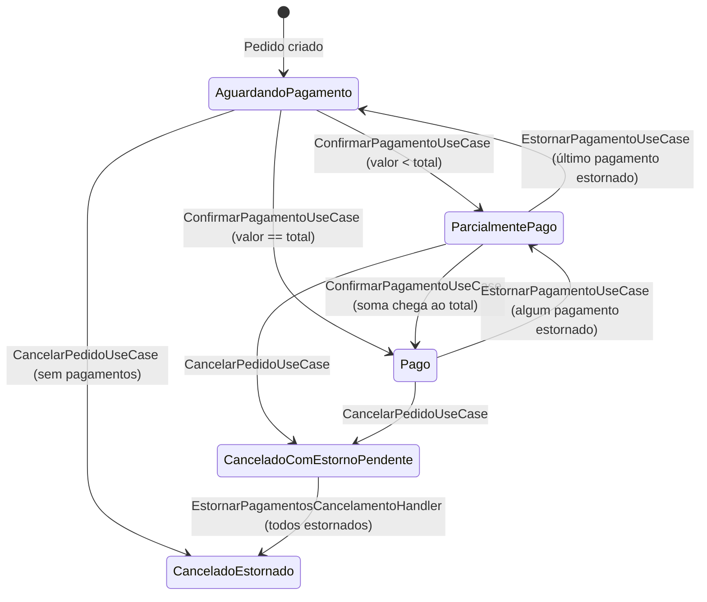
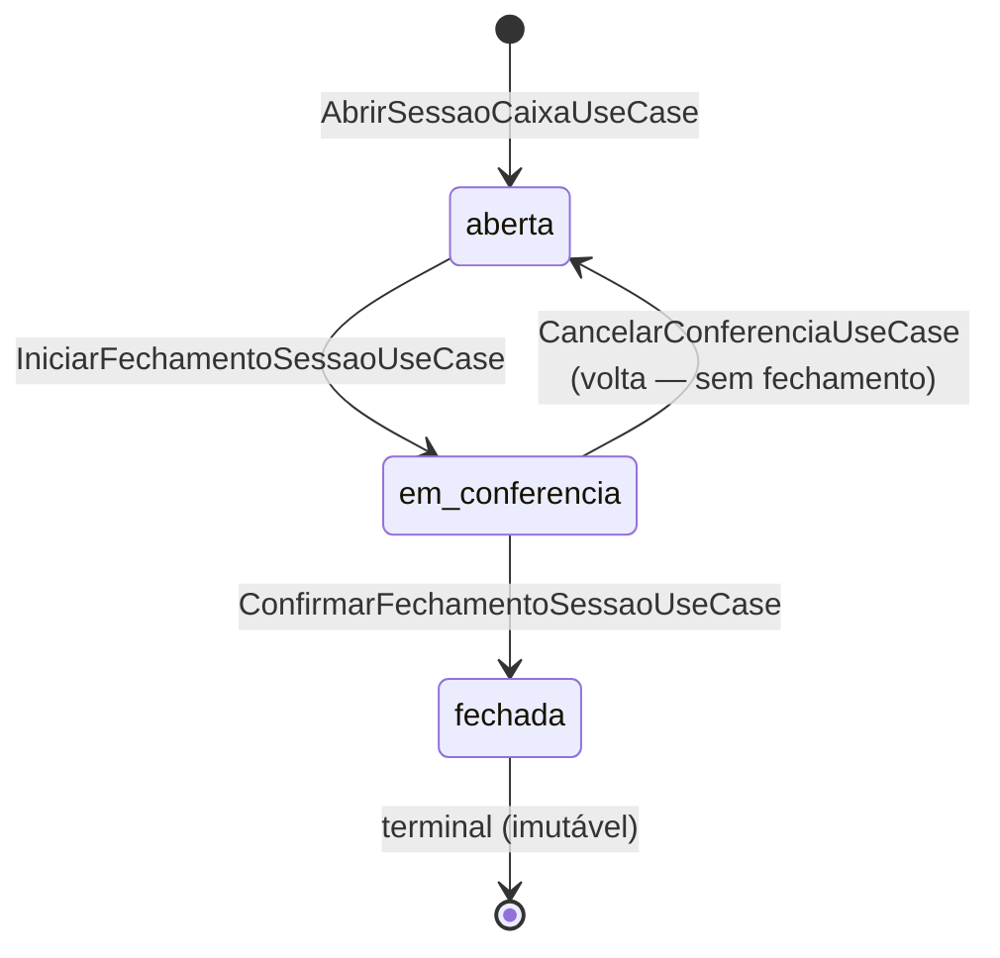

# 02 — Estados e Eventos

> Parte do [Plano](README.md). Anterior: [01-dominio.md](01-dominio.md). Próximo: [03-api.md](03-api.md).

### C.1 Estados de Pedido (em relação a pagamento)

Estado financeiro do pedido é **derivado** (computed) a partir de `Status`
+ `Pagamentos.Where(p => p.Status == "confirmado").Sum(Valor)`. Não há
coluna persistida.

```csharp
public enum EstadoFinanceiroPedido
{
    AguardandoPagamento,            // TotalPago == 0 e Status != Cancelado
    ParcialmentePago,               // 0 < TotalPago < Total
    Pago,                           // TotalPago == Total
    CanceladoComEstornoPendente,    // Status=Cancelado mas existe pagamento confirmado
    CanceladoEstornado,             // Status=Cancelado e todos pagamentos estornados/sem pagamentos
    // PagoComExcedente é REJEITADO em validação (HTTP 422)
}
```

**Detecção** (método `Pedido.EstadoFinanceiro` novo, computed):

```csharp
public EstadoFinanceiroPedido EstadoFinanceiro
{
    get
    {
        var totalConfirmado = Pagamentos.Where(p => p.Status == "confirmado").Sum(p => p.Valor);
        if (StatusEnum == StatusPedido.Cancelado)
        {
            return totalConfirmado > 0
                ? EstadoFinanceiroPedido.CanceladoComEstornoPendente
                : EstadoFinanceiroPedido.CanceladoEstornado;
        }
        if (totalConfirmado == 0) return EstadoFinanceiroPedido.AguardandoPagamento;
        if (totalConfirmado < Total.Valor) return EstadoFinanceiroPedido.ParcialmentePago;
        if (totalConfirmado == Total.Valor) return EstadoFinanceiroPedido.Pago;
        throw new InvariantViolatedException("TotalPago > Total — viola invariante de pagamento");
    }
}
```

**Transições e gatilhos**:



Validação que rejeita `PagoComExcedente`: `ConfirmarPagamentoUseCase` antes
de inserir, calcula `novoTotalConfirmado = pedido.TotalPagoConfirmado + cmd.Valor`
e se `> pedido.Total.Valor` lança `UseCaseValidationException` → HTTP 422.

### C.2 Estados de `SessaoCaixa`

```csharp
public static class SessaoCaixaStateMachine
{
    public static readonly Dictionary<string, HashSet<string>> Transicoes = new()
    {
        ["aberta"] = new() { "em_conferencia" },
        ["em_conferencia"] = new() { "fechada", "aberta" }, // ↓ pode voltar se operador cancelar conferência
        ["fechada"] = new() { /* terminal */ }
    };
}
```



**Irreversibilidade do fechamento**: aplicada via interceptor EF
`FechamentoCaixaImutavelInterceptor`:

```csharp
public class FechamentoCaixaImutavelInterceptor : SaveChangesInterceptor
{
    public override InterceptionResult<int> SavingChanges(...)
    {
        var ctx = eventData.Context;
        foreach (var entry in ctx.ChangeTracker.Entries<FechamentoCaixa>())
        {
            if (entry.State == EntityState.Modified || entry.State == EntityState.Deleted)
                throw new RegraDeDominioVioladaException(
                    "FechamentoCaixa é imutável após criação. Use MovimentoCaixa de ajuste na próxima sessão.");
        }
        foreach (var entry in ctx.ChangeTracker.Entries<SessaoCaixa>())
        {
            if (entry.State == EntityState.Modified
                && entry.OriginalValues.GetValue<string>("Status") == "fechada")
                throw new RegraDeDominioVioladaException(
                    "SessaoCaixa fechada não pode ser modificada.");
        }
        return base.SavingChanges(eventData, result);
    }
}
```

Registrar no `EasyStockDbContext` via `DbContextOptionsBuilder.AddInterceptors`.

### C.3 Camada de eventos — decisão

**Escolha: HÍBRIDA**

- **Handlers críticos de invariante (Pagamento → MovimentoCaixa)**: chamados
  **inline na mesma transação** dentro do UseCase composto. Sem indireção,
  sem outbox, sem race. Padrão já usado em
  `RegistrarPagamentoPedidoUseCase.TentarAbrirCaixaAsync`.
- **Eventos externos / observabilidade (email contador, webhook, audit
  extra)**: persistidos como `OutboxEventoIntegracao` na **mesma transação**
  do UseCase, despachados async pelo `IntegrationOutboxBackgroundService`.

**Por que não MediatR**: convenção da casa é UseCase chamando UseCase
diretamente (sem mediator). Adicionar MediatR só para este módulo cria
inconsistência. `IPublicadorEventos` (stub atual) é mantido para hooks
futuros mas não usado como pilar de invariante.

**Por que não outbox para tudo**: handler de `PagamentoConfirmado →
MovimentoCaixa` PRECISA estar na mesma transação para garantir invariante
"todo pagamento confirmado tem movimento de caixa (ou null marcado retroativo)".
Outbox separa commit, abre janela de race.

#### C.3.1 Como evento é emitido (eventos externos)

```csharp
// Dentro de ConfirmarPagamentoUseCase, antes de uow.CommitAsync():
await outboxRepo.AddAsync(OutboxEventoIntegracao.Criar(
    empresaId: cmd.EmpresaId,
    tipoEvento: "pagamento.confirmado",
    aggregateType: "Pagamento",
    aggregateId: pagamento.Id,
    payload: new { pagamentoId = pagamento.Id, pedidoId = pedido.Id, valor = pagamento.Valor, metodo = pagamento.Metodo, conciliacaoTipo = pagamento.ConciliacaoTipo },
    idempotencyKey: $"{cmd.EmpresaId:N}|pagamento.confirmado|{pagamento.Id:N}"));
await uow.CommitAsync(); // commit atômico: pagamento + movimento + outbox
```

#### C.3.2 Como handler é chamado

- **In-process inline (transacional)**: UseCase composto chama método helper
  (`CriarMovimentoCaixaParaPagamento`). Sem broker, sem timer.
- **Background (outbox)**: `IntegrationOutboxBackgroundService` poll a cada
  5s, processa em batch de 50, shard por `aggregate_id % 4`.

#### C.3.3 Retry policy

- **Inline**: zero retry — falha = rollback da transação inteira.
- **Outbox**: 5 tentativas com backoff exponencial 1s, 5s, 25s, 2min, 10min
  (já implementado em `OutboxEventoIntegracao.MarcarFalhaTentativa`). Após
  5 falhas, status `falhou_permanente`, alerta via log + audit log.

#### C.3.4 Idempotência

- **Inline**: garantido por transação atômica + check de invariante.
- **Outbox**: `IdempotencyKey` no payload usa hash determinístico
  (`SHA256($"{EmpresaId:N}|{TipoEvento}|{AggregateId:N}")`). Handler downstream
  consulta tabela `outbox_eventos_integracao_processados` (já existe) antes de aplicar.

#### C.3.5 Auditoria

- **Outbox**: registros são mantidos com retention de 180 dias em
  `outbox_eventos_integracao` (config existente em `EntityAlteracaoRetentionService`).
- **EntityAlteracao**: `PedidoPagamento`, `SessaoCaixa`, `FechamentoCaixa`
  registrados com retention 1825 dias (5 anos — requisito regulatório
  Receita Federal).

### C.4 Lista completa de eventos de domínio

#### C.4.1 `PagamentoConfirmado`

```csharp
public sealed record PagamentoConfirmado(
    Guid EventoId, DateTime OcorridoEm,
    Guid PagamentoId, Guid PedidoId, Guid EmpresaId, Guid? LojaId,
    string Metodo, decimal Valor, string ConciliacaoTipo,
    Guid? SessaoCaixaId, Guid? MovimentoCaixaId,
    Guid? RegistradoPorUserId) : DomainEvent(EventoId, OcorridoEm);
```

- **Emitido por**: `ConfirmarPagamentoUseCase.ExecuteAsync` (após criar
  pagamento + movimento), antes de commit.
- **Consumidores (inline na mesma TX)**:
  - `CriarMovimentoCaixaHandler` — cria `MovimentoCaixa` tipo `pagamento`
    linkado, se sessão aberta existe.
- **Consumidores (via outbox)**:
  - `WebhookPagamentoConfirmadoHandler` (futuro F+1).
- **Falha de handler inline**: rollback completo. Pagamento NÃO é criado.

#### C.4.2 `PagamentoEstornado`

```csharp
public sealed record PagamentoEstornado(
    Guid EventoId, DateTime OcorridoEm,
    Guid PagamentoEstornoId, Guid PagamentoOriginalId,
    Guid PedidoId, Guid EmpresaId,
    decimal Valor, string Motivo,
    Guid? EstornadoPorUserId) : DomainEvent(EventoId, OcorridoEm);
```

- **Emitido por**: `EstornarPagamentoUseCase`.
- **Consumidores (inline)**:
  - `CriarMovimentoCaixaEstornoHandler` — cria `MovimentoCaixa` tipo
    `estorno_pagamento` apontando para movimento original.
- **Consumidores (outbox)**: webhook (futuro).

#### C.4.3 `PedidoCancelado` (já existe como `PedidoEvento` tipo `"cancelado"`)

- **Emitido por**: `CancelarPedidoUseCase` (já existe). Estendido para emitir
  via outbox quando há pagamentos confirmados.
- **Consumidor novo (inline)**:
  - `EstornarPagamentosCancelamentoHandler` — itera
    `pedido.Pagamentos.Where(Status == "confirmado")` e chama
    `EstornarPagamentoUseCase` para cada um, com motivo
    `"Cancelamento de pedido — estorno automático"`. Atomicamente.

#### C.4.4 `SessaoCaixaIniciandoFechamento`

```csharp
public sealed record SessaoCaixaIniciandoFechamento(
    Guid EventoId, DateTime OcorridoEm,
    Guid SessaoCaixaId, Guid EmpresaId, Guid? LojaId,
    DateOnly DataOperacional, Guid? IniciadaPorUserId) : DomainEvent(EventoId, OcorridoEm);
```

- **Emitido por**: `IniciarFechamentoSessaoUseCase`.
- **Consumidor inline**: nenhum (UseCase apenas muda status para `em_conferencia`
  e congela snapshot temporário em cache de leitura).
- **Falha**: rollback simples.

#### C.4.5 `SessaoCaixaFechadaEvent`

```csharp
public sealed record SessaoCaixaFechadaEvent(
    Guid EventoId, DateTime OcorridoEm,
    Guid SessaoCaixaId, Guid FechamentoCaixaId, Guid EmpresaId, Guid? LojaId,
    DateOnly DataOperacional, decimal SaldoFinal, string HashSha256,
    string VerificacaoCodigo, Guid? FechadaPorUserId) : DomainEvent(EventoId, OcorridoEm);
```

- **Emitido por**: `ConfirmarFechamentoSessaoUseCase`, **após** PDF gerado +
  upload concluído + commit SQL bem-sucedido (ver sequência detalhada em
  D.2.6).
- **Consumidores inline**: nenhum — PDF, hash e upload já aconteceram
  pré-commit. Não há handler que precise rodar atômico.
- **Consumidores outbox**:
  - `EnviarEmailContadorHandler` (se `cmd.enviarEmailContador && cmd.emailContador != null`).
- **Falha de email**: retry via outbox (5 tentativas, backoff exponencial
  já implementado em `OutboxEventoIntegracao`). Operadora NÃO é notificada
  desse retry — fechamento está concluído; envio é best-effort.

#### C.4.6 `MovimentoManualRegistrado` (sangria/reforço/despesa/entrada)

```csharp
public sealed record MovimentoManualRegistrado(
    Guid EventoId, DateTime OcorridoEm,
    Guid MovimentoId, Guid SessaoCaixaId, Guid EmpresaId,
    string Tipo, decimal Valor, string? Categoria,
    Guid? RegistradoPorUserId) : DomainEvent(EventoId, OcorridoEm);
```

- **Emitido por**: `RegistrarMovimentoManualUseCase`.
- **Consumidores**: nenhum inline. Invalida cache de relatório (se houver)
  via outbox `cache.invalidar`.

#### C.4.7 Tabela resumo

| Evento | Emissor | Modo | Handler crítico | Falha handler |
|---|---|---|---|---|
| PagamentoConfirmado | ConfirmarPagamentoUseCase | inline + outbox | CriarMovimentoCaixaHandler | Rollback pagamento |
| PagamentoEstornado | EstornarPagamentoUseCase | inline + outbox | CriarMovimentoCaixaEstornoHandler | Rollback estorno |
| PedidoCancelado | CancelarPedidoUseCase | inline + outbox | EstornarPagamentosCancelamentoHandler | Rollback cancelamento |
| SessaoCaixaIniciandoFechamento | IniciarFechamentoSessaoUseCase | inline | nenhum | n/a |
| SessaoCaixaFechadaEvent | ConfirmarFechamentoSessaoUseCase | apenas outbox (PDF é pré-commit; ver D.2.6) | EnviarEmailContadorHandler (outbox, opcional) | retry email |
| MovimentoManualRegistrado | RegistrarMovimentoManualUseCase | outbox | nenhum crítico | retry |

---
